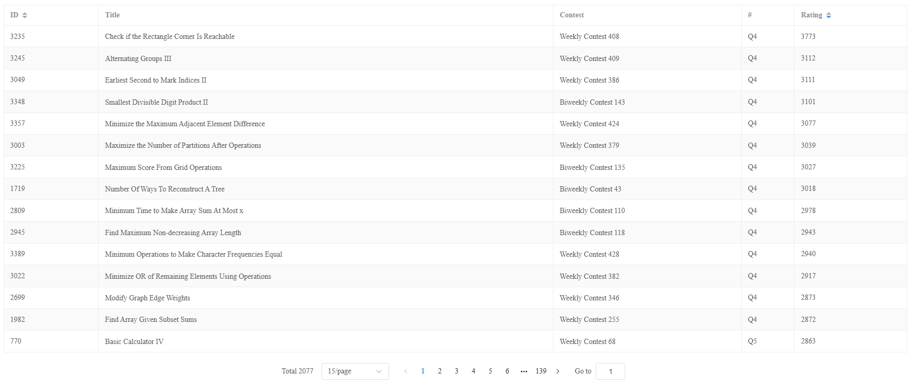
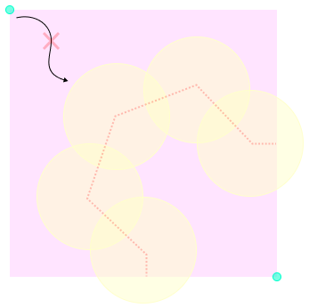

# LeetCode's Hardest Problem

This problem is rated as the **top most difficult question** on [LeetCode](https://leetcode.com/problems/check-if-the-rectangle-corner-is-reachable) by [zerotrac's rating](https://zerotrac.github.io/leetcode_problem_rating/).



Fortunately, I managed to achieve a "beats 100%" score. ✌️


## Programming Languages

I've tackled this problem using [TypeScript](https://github.com/tommyinb/leetcode-hardest-problem), [C#](https://github.com/tommyinb/leetcode-hardest-problem-csharp) and [Java](https://github.com/tommyinb/leetcode-hardest-problem-java).

If you want to learn more, I've created a interactive page for you. ✨

Learn more 👉 <https://tommyinb.github.io/leetcode-hardest-problem/>

## Check if the Rectangle Corner is Reachable

In fact, this question can be easily solved by BFS and simple geometry. We just need check if the circles can be connected together blocking all the path from origin to corner.



## Beats 100%

What makes my solution unique is the restructuring of the search algorithm. Instead of only progressing forward from the start, it also traces backward from the end. This significantly reduces the search space, resulting in much faster performance with minimal added complexity.

```cs
while (currentCircles.Count > 0)
{
    var currentCircle = currentCircles.Dequeue();

    var started = false;
    foreach (var startPath in startPaths)
    {
        var pathCircle = startPath.Circles.Last();
        if (IntersectingCircle(currentCircle, pathCircle, question.Area))
        {
            started = true;

            startPath.Circles.Add(currentCircle);
        }
    }

    foreach (var endPath in endPaths)
    {
        var pathCircle = endPath.Circles.Last();
        if (IntersectingCircle(currentCircle, pathCircle, question.Area))
        {
            if (started != null)
            {
                return true;
            }

            endPath.Circles.Add(currentCircle);
        }
    }
}
```

## Code

Check out the code here 👉 [Solution.cs](./Solution.cs) 👈😊
Happy coding!
